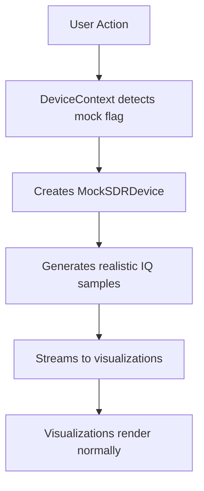

# End-to-End Testing Guide

## Overview

rad.io supports **two E2E testing modes** to accommodate different development and testing scenarios:

1. **Mock Device Mode** (CI-friendly) - No hardware required
2. **Real Device Mode** (Hardware testing) - Uses actual HackRF hardware

This dual-mode approach enables:

- ✅ Reliable CI/CD testing without hardware dependencies
- ✅ Real-world hardware integration testing when needed
- ✅ Rapid development iteration without physical devices
- ✅ Comprehensive test coverage across all scenarios

## Quick Start

### Mock Device Mode (Default)

**No hardware required** - Uses `MockSDRDevice` to generate realistic IQ data.

```bash
# Run all E2E tests (mock mode by default)
npm run test:e2e

# Run with UI mode for debugging
npm run test:e2e:ui

# Run in headed mode (see browser)
npm run test:e2e:headed
```

### Optional: GPU-accelerated local project

Some visualization features can take advantage of GPU acceleration (WebGL/WebGPU) when available. You can opt into a headed Chromium project with GPU-friendly flags for local runs:

```bash
# Enable the GPU project and run only that project
$env:RADIO_E2E_GPU = "1"; npm run test:e2e -- --project=gpu-chromium

# Or use bash/zsh
RADIO_E2E_GPU=1 npm run test:e2e -- --project=gpu-chromium
```

Notes:

- This does not run in CI by default. It’s enabled only when `RADIO_E2E_GPU=1` is set.
- Even without GPU, the tests will still run using Canvas2D/Worker fallbacks.

The dev server automatically starts on `https://localhost:8080` with a self-signed certificate.

### Real Device Mode (Hardware Required)

**Requires HackRF One** - Tests with actual SDR hardware.

```bash
# First-time setup: Pair your device
# 1. Connect HackRF via USB
# 2. Visit https://localhost:8080/monitor
# 3. Click "Connect Device" button
# 4. Select HackRF from browser dialog (one-time pairing)

# Run E2E tests with real hardware
export E2E_REAL_HACKRF=1        # Unix/Mac/Linux
# OR
$env:E2E_REAL_HACKRF = "1"      # Windows PowerShell

npm run test:e2e
```

## Understanding Mock Mode

### How Mock SDR Works

The `MockSDRDevice` class implements the `ISDRDevice` interface and generates synthetic IQ samples:



**Key Files**:

- `src/models/MockSDRDevice.ts` - Mock device implementation
- `src/utils/e2e.ts` - Mock flag detection (`shouldUseMockSDR()`)
- `src/contexts/DeviceContext.tsx` - Device provider with mock injection

### Enabling Mock Mode

Mock mode activates when **any** of the following is present:

1. **URL Query Parameter**: `?mockSdr=1`

   ```typescript
   // In E2E test
   await page.goto("https://localhost:8080/monitor?mockSdr=1");
   ```

2. **localStorage Flag**: `radio:e2e:mockSdr = "1"`

   ```typescript
   // Set in browser console or test
   localStorage.setItem("radio:e2e:mockSdr", "1");
   ```

3. **Build-Time Environment**: `E2E_MOCK_SDR=1`
   ```bash
   E2E_MOCK_SDR=1 npm run build
   ```

**Detection Logic**:

```typescript
// src/utils/e2e.ts
export function shouldUseMockSDR(): boolean {
  // Check URL param
  const params = new URLSearchParams(window.location.search);
  if (params.get("mockSdr") === "1") return true;

  // Check localStorage
  if (localStorage.getItem("radio:e2e:mockSdr") === "1") return true;

  // Check build-time flag
  if (process.env.E2E_MOCK_SDR === "1") return true;

  return false;
}
```

### Mock Device Behavior

The `MockSDRDevice` generates realistic signal patterns:

**Generated Patterns**:

- Sine waves at configurable frequencies
- QPSK modulation patterns
- FM modulation with carrier
- White noise floor
- Multi-tone signals

**Streaming Characteristics**:

- Sample rate: 2,048,000 samples/sec (configurable)
- Chunk size: 16,384 samples per callback
- Update interval: 100ms (configurable)
- IQ values: Normalized to [-1.0, 1.0] range

**Example Usage**:

```typescript
const mockDevice = new MockSDRDevice();
await mockDevice.open();
await mockDevice.setFrequency(100e6);
await mockDevice.receive((samples) => {
  // Process IQ samples
  console.log(`Received ${samples.length} samples`);
});
```

## Why No Real HackRF E2E Tests?

**WebUSB API cannot be automated with Playwright.** This is a fundamental limitation:

1. **User gestures required** - WebUSB device pairing requires manual user selection from a browser dialog
2. **Sandboxed environment** - Playwright's automation context blocks native hardware APIs
3. **Security restrictions** - Browser automation tools cannot access USB devices for security reasons

### Real Hardware Testing

For testing with actual HackRF devices, see:

- **Manual testing checklist**: `e2e/monitor-real-manual.md`
- **Integration tests**: `src/hooks/__tests__/useUSBDevice.test.ts` (mocked WebUSB)
- **Playwright MCP tools**: Semi-automated browser control (requires user interaction for device pairing)

Resource management:

- The Playwright config now creates the real-device project only when `E2E_REAL_HACKRF=1` is set. This prevents an extra Chrome instance from launching in default runs (lower memory use).
- Local runs are limited to 2 workers and file-level parallelism is disabled to avoid Chromium renderer OOM on machines with limited RAM. CI already uses 1 worker.
- Traces are kept only on failure to keep artifact sizes small.

## How the mock works

- `src/models/MockSDRDevice.ts` implements the `ISDRDevice` contract and generates IQ sample chunks periodically.
- Mock mode is activated when any of the following is present:
  - URL query param `?mockSdr=1`
  - `localStorage["radio:e2e:mockSdr"] === "1"`
  - `process.env.E2E_MOCK_SDR === "1"` at build-time
- `DeviceProvider` detects the flag via `shouldUseMockSDR()` and creates one mock device entry.

## Test entries

- `e2e/monitor-mock.spec.ts` — CI-friendly smoke test that starts/stops reception with the mock device
- `e2e/monitor-real.spec.ts` — opt-in real device test (tagged `@real` and additionally gated by E2E_REAL_HACKRF)
- `e2e/accessibility.spec.ts` — existing a11y coverage (unchanged)

## Writing E2E Tests

### Test Structure

```typescript
// e2e/my-feature.spec.ts
import { test, expect } from "@playwright/test";

test.describe("My Feature", () => {
  test("works with mock device", async ({ page }) => {
    // Navigate with mock flag
    await page.goto("https://localhost:8080/monitor?mockSdr=1");

    // Interact with UI
    await page.click('button:has-text("Start reception")');

    // Wait for visualization
    await page.waitForSelector('canvas[role="img"]');

    // Assertions
    const canvas = page.locator('canvas[role="img"]').first();
    await expect(canvas).toBeVisible();
  });
});
```

### Best Practices

1. **Use Mock Mode for CI Tests**

   ```typescript
   // Always include ?mockSdr=1 for CI tests
   await page.goto("https://localhost:8080/monitor?mockSdr=1");
   ```

2. **Wait for Streaming Before Checking Visualizations**

   ```typescript
   // Start reception
   await page.click('button:has-text("Start reception")');

   // Wait for canvas to appear (only renders when data flows)
   await page.waitForSelector('canvas[role="img"]', { timeout: 5000 });
   ```

3. **Use Accessible Selectors**

   ```typescript
   // ✅ Good - uses accessible name
   await page.click('button:has-text("Start reception")');

   // ❌ Bad - relies on implementation details
   await page.click(".start-button");
   ```

4. **Check Data Flow, Not Just UI**

   ```typescript
   // Verify data is actually flowing
   const isReceiving = await page.evaluate(() => window.dbgReceiving);
   expect(isReceiving).toBe(true);
   ```

5. **Clean Up After Tests**
   ```typescript
   test.afterEach(async ({ page }) => {
     // Stop any active streaming
     await page.click('button:has-text("Stop reception")').catch(() => {});
   });
   ```

### Testing Visualizations

```typescript
test("visualizations render with mock data", async ({ page }) => {
  await page.goto("https://localhost:8080/monitor?mockSdr=1");

  // Start streaming
  await page.click('button:has-text("Start reception")');

  // Wait for all visualizations to appear
  await page.waitForSelector('canvas[role="img"]');

  // Count visualizations
  const canvases = await page.locator('canvas[role="img"]').count();
  expect(canvases).toBeGreaterThanOrEqual(3); // IQ, Waveform, Spectrogram

  // Verify ARIA labels
  const iqCanvas = page.locator('canvas[aria-label*="constellation" i]');
  await expect(iqCanvas).toBeVisible();

  const spectrogram = page.locator('canvas[aria-label*="spectrogram" i]');
  await expect(spectrogram).toBeVisible();
});
```

### Testing Real Device (Hardware)

```typescript
test("receives from real HackRF", async ({ page }) => {
  // Skip if hardware not available
  if (!process.env.E2E_REAL_HACKRF) {
    test.skip();
  }

  await page.goto("https://localhost:8080/monitor");

  // Wait for auto-connect (device must be pre-paired)
  await page.waitForSelector(
    'button:has-text("Start reception"):not([disabled])',
    { timeout: 10000 },
  );

  // Verify device connected
  const deviceName = await page.textContent('[data-testid="device-name"]');
  expect(deviceName).toContain("HackRF");

  // Start reception
  await page.click('button:has-text("Start reception")');

  // Verify real data
  await page.waitForSelector('canvas[role="img"]');

  // Check for actual signal processing
  await page.waitForTimeout(2000); // Allow time for real samples
  const hasSignal = await page.evaluate(() => window.dbgReceiving);
  expect(hasSignal).toBe(true);
});
```

## Test Organization

### File Structure

```
e2e/
├── monitor-mock.spec.ts          # Mock device tests (CI)
├── monitor-real.spec.ts          # Real hardware tests (opt-in)
├── accessibility.spec.ts         # Accessibility tests
├── visualizations.spec.ts        # Visualization-specific tests
└── navigation.spec.ts            # Page navigation tests
```

### Test Tags

Use tags to organize tests:

```typescript
// Mock tests (always run)
test("mock device test", async ({ page }) => {
  /* ... */
});

// Real device tests (opt-in with @real tag)
test("@real hardware test", async ({ page }) => {
  if (!process.env.E2E_REAL_HACKRF) test.skip();
  /* ... */
});

// Slow tests
test.slow("complex integration test", async ({ page }) => {
  /* ... */
});
```

## Continuous Integration

### GitHub Actions Configuration

The E2E tests run automatically in CI:

```yaml
# .github/workflows/e2e.yml
- name: Run E2E tests
  run: npm run test:e2e
  env:
    # Mock mode only in CI
    CI: true
```

**CI Behavior**:

- Mock device mode only (no hardware)
- 1 worker (prevents OOM on CI runners)
- Retries: 2 attempts on failure
- Timeout: 30 seconds per test
- Traces saved only on failure

### Local vs CI

| Feature     | Local            | CI         |
| ----------- | ---------------- | ---------- |
| Device Mode | Mock or Real     | Mock only  |
| Workers     | 2 (configurable) | 1          |
| Browser     | Headed/Headless  | Headless   |
| Retries     | 0                | 2          |
| Traces      | Always           | On failure |

## Troubleshooting

### Mock Device Issues

**Problem**: Visualizations not appearing

```typescript
// Solution: Ensure mock flag is set
await page.goto("https://localhost:8080/monitor?mockSdr=1");

// Verify mock mode active
const mockActive = await page.evaluate(
  () =>
    localStorage.getItem("radio:e2e:mockSdr") === "1" ||
    new URLSearchParams(window.location.search).get("mockSdr") === "1",
);
expect(mockActive).toBe(true);
```

**Problem**: Start button disabled

```typescript
// Solution: Wait for mock device initialization
await page.waitForSelector(
  'button:has-text("Start reception"):not([disabled])',
  { timeout: 5000 },
);
```

### Real Device Issues

**Problem**: Device not found

```bash
# Solution: Pair device first
# 1. Open https://localhost:8080/monitor in Chrome
# 2. Click "Connect Device"
# 3. Select HackRF from dialog
# 4. Grant permission

# Verify device in paired list
# Run in browser console:
navigator.usb.getDevices().then(devices => console.log(devices));
```

**Problem**: Permission denied

```typescript
// Solution: Check device permissions
const devices = await page.evaluate(() => navigator.usb.getDevices());
console.log("Paired devices:", devices.length);
```

**Problem**: Timeout waiting for connection

```typescript
// Solution: Increase timeout for hardware
await page.waitForSelector(
  'button:has-text("Start reception"):not([disabled])',
  { timeout: 15000 }, // Increase for hardware
);
```

### HTTPS Certificate Issues

**Problem**: Self-signed certificate errors

**Solution**: Playwright config handles this automatically

```typescript
// playwright.config.ts
use: {
  ignoreHTTPSErrors: true, // Accepts self-signed certs
}
```

**Local Development**: Accept certificate once in browser

1. Visit https://localhost:8080
2. Click "Advanced" → "Proceed to localhost"
3. Certificate trusted for this session

### Audio Context Restrictions

**Problem**: Audio context suspended

**Solution**: Tests click Start button to serve as user gesture

```typescript
// User gesture required to unlock audio
await page.click('button:has-text("Start reception")');

// Verify audio context running
const audioState = await page.evaluate(() => {
  const ctx = window.audioContext;
  return ctx ? ctx.state : "no context";
});
expect(audioState).toBe("running");
```

### Dev Server Already Running

**Problem**: Port 8080 already in use

**Solution**: Playwright config reuses existing server

```typescript
// playwright.config.ts
webServer: {
  command: 'npm run dev',
  url: 'https://localhost:8080',
  reuseExistingServer: true, // Uses existing server
}
```

**Manual Stop**:

```bash
# Find process on port 8080
lsof -i :8080  # Mac/Linux
netstat -ano | findstr :8080  # Windows

# Kill process
kill -9 <PID>  # Mac/Linux
taskkill /PID <PID> /F  # Windows
```

### Test Flakiness

**Common Causes**:

1. Race conditions (not waiting for async operations)
2. Timing issues (network delays, rendering delays)
3. Resource contention (multiple tests running in parallel)

**Solutions**:

```typescript
// 1. Use proper waits
await page.waitForSelector('canvas[role="img"]');
await page.waitForLoadState("networkidle");

// 2. Add explicit timeouts for slow operations
await page.click("button", { timeout: 10000 });

// 3. Run tests serially if needed
test.describe.configure({ mode: "serial" });

// 4. Use soft assertions for non-critical checks
await expect.soft(page.locator(".optional")).toBeVisible();
```

## Performance Optimization

### Resource Management

**Limit Workers**:

```typescript
// playwright.config.ts
workers: process.env.CI ? 1 : 2,
```

**Disable Parallelism for File**:

```typescript
// In test file
test.describe.configure({ mode: "serial" });
```

**Reduce Trace Size**:

```typescript
// playwright.config.ts
use: {
  trace: 'on-first-retry', // Only save on failures
}
```

### Memory Management

**Clear State Between Tests**:

```typescript
test.afterEach(async ({ page }) => {
  // Stop streaming
  await page.click('button:has-text("Stop")').catch(() => {});

  // Clear localStorage
  await page.evaluate(() => localStorage.clear());
});
```

**Monitor Memory**:

```typescript
test("memory usage", async ({ page }) => {
  await page.goto("https://localhost:8080/monitor?mockSdr=1");

  const metrics = await page.evaluate(() => {
    if (performance.memory) {
      return {
        used: performance.memory.usedJSHeapSize,
        total: performance.memory.totalJSHeapSize,
      };
    }
    return null;
  });

  console.log("Heap usage:", metrics);
});
```

## Additional Resources

### Documentation

- [Visualization Architecture](./VISUALIZATION_ARCHITECTURE.md) - How visualizations work
- [Testing Strategy](./testing/TEST_STRATEGY.md) - Overall testing approach
- [New Contributor Guide](./ONBOARDING.md) - Getting started

### Code References

- `src/models/MockSDRDevice.ts` - Mock device implementation
- `src/utils/e2e.ts` - Mock flag detection
- `src/contexts/DeviceContext.tsx` - Device provider
- `e2e/*.spec.ts` - Example tests

### External Resources

- [Playwright Documentation](https://playwright.dev/)
- [WebUSB API](https://developer.mozilla.org/en-US/docs/Web/API/WebUSB_API)
- [Testing Best Practices](https://playwright.dev/docs/best-practices)

## Contributing

When adding E2E tests:

1. **Write mock tests first** - Most scenarios can be tested without hardware
2. **Add real device tests sparingly** - Only for hardware-specific features
3. **Use accessible selectors** - ARIA labels, roles, semantic HTML
4. **Handle async properly** - Always wait for operations to complete
5. **Keep tests fast** - Aim for <10 seconds per test
6. **Document assumptions** - Comment on timing, device state, etc.

See [CONTRIBUTING.md](../CONTRIBUTING.md) for general contribution guidelines.
