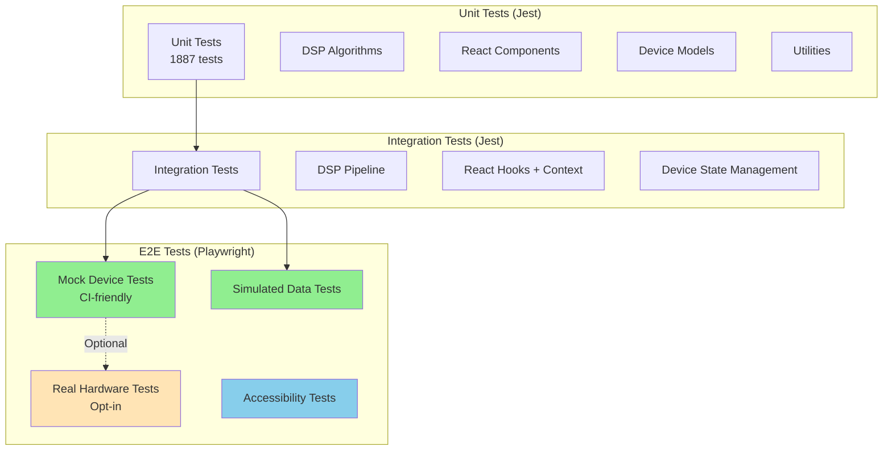

# Test Strategy Reference

## Overview

This reference document provides a comprehensive overview of the rad.io automated test suite, covering unit tests,
integration tests, and end-to-end (E2E) tests. It complements the detailed testing guides in
[`docs/testing/`](../testing/) with SDR-specific context and hardware integration patterns.

## Test Architecture



## Test Categories

### Unit Tests

**Purpose**: Test individual functions, classes, and React components in isolation.

**Location**: `src/**/__tests__/*.test.ts(x)`

**Test Count**: 1887 tests across 136 test suites

**Coverage Requirements**:

- Global minimum: 64% statements, 52% branches, 67% functions, 64% lines
- Critical modules: Higher thresholds (see [Coverage Thresholds](#coverage-thresholds))

**Key Testing Areas**:

1. **DSP Algorithms** (`src/utils/__tests__/dsp*.test.ts`)
   - FFT computation (WebAudio, WASM fallbacks)
   - Filtering and decimation
   - Demodulation (FM, AM, SSB)
   - Signal processing pipeline

2. **React Components** (`src/components/__tests__/`)
   - UI interactions
   - State management
   - Accessibility (ARIA, keyboard navigation)
   - Visual rendering

3. **Device Models** (`src/models/__tests__/`, `src/hackrf/__tests__/`)
   - HackRF One adapter
   - RTL-SDR device
   - Airspy device
   - Mock SDR device

4. **Utilities** (`src/utils/__tests__/`)
   - Signal generation
   - Data export/import
   - Performance monitoring
   - Memory management

**Best Practices**:

- Keep tests fast (<100ms per test)
- Mock expensive operations (WebUSB, WebGL, WASM)
- Test behavior, not implementation
- Use descriptive test names: `should <behavior> when <condition>`

### Integration Tests

**Purpose**: Test interactions between multiple modules or components.

**Location**: Mixed within `src/**/__tests__/` alongside unit tests

**Examples**:

1. **DSP Pipeline Integration**

   ```typescript
   // Tests data flow: IQ samples → FFT → filtering → demodulation
   test('complete DSP pipeline processes samples correctly', () => {
     const iqSamples = generateIQSamples({ ... });
     const fftResult = calculateFFT(iqSamples);
     const filtered = applyFilter(fftResult, filterConfig);
     const audio = demodulate(filtered, 'FM');
     expect(audio).toBeDefined();
   });
   ```

2. **Device State Management**

   ```typescript
   // Tests: connect → configure → stream → stop workflow
   test('device lifecycle completes successfully', async () => {
     await device.open();
     await device.setFrequency(100e6);
     await device.setSampleRate(2048000);
     await device.receive(handleSamples);
     await device.stop();
   });
   ```

3. **React Hooks with Context**

   ```typescript
   // Tests hooks interacting with DeviceContext
   test('useHackRFDevice updates on context changes', () => {
     const { result } = renderHook(() => useHackRFDevice(), {
       wrapper: ({ children }) => (
         <DeviceContext.Provider value={mockContext}>
           {children}
         </DeviceContext.Provider>
       ),
     });
     expect(result.current.device).toBeDefined();
   });
   ```

**Best Practices**:

- Minimize scope: test 2-3 components together
- Use real implementations where possible (avoid over-mocking)
- Test critical user flows and data pipelines
- Keep execution time <1 second per test

### End-to-End (E2E) Tests

**Purpose**: Test the application from a user's perspective in a real browser.

**Location**: `e2e/*.spec.ts`

**Test Count**: 26+ tests (mock + simulated), 8+ device tests (opt-in)

**Tools**:

- Playwright (browser automation)
- @axe-core/playwright (accessibility)
- MockSDRDevice (CI-friendly testing)

#### E2E Test Modes

**1. Mock Device Tests** (CI-default)

```bash
npm run test:e2e
```

- No hardware required
- Uses `MockSDRDevice` for realistic IQ data generation
- Fast and deterministic
- Runs in CI/CD automatically

### 2. Simulated Data Tests

```bash
npm run test:e2e:sim
```

- Uses `SimulatedSource` for pre-generated data
- Tests visualization rendering with known patterns
- Validates frequency sweeps, modulation patterns
- Included in default CI runs

**3. Real Hardware Tests** (Opt-in)

```bash
E2E_REAL_HACKRF=1 npm run test:e2e       # Legacy @real tests
npm run test:e2e:device                   # Modern @device tests
```

- Requires physical HackRF One device
- Tests actual WebUSB integration
- Hardware-in-the-loop validation
- Manual execution only (not in CI)

### 4. Accessibility Tests

```bash
npm run test:e2e  # Included in default run
```

- Automated WCAG 2.1 AA compliance checks
- ARIA label validation
- Keyboard navigation testing
- Color contrast verification

**Key E2E Test Files**:

- `e2e/monitor-mock.spec.ts` - Mock device smoke tests
- `e2e/visualization-simulated.spec.ts` - Simulated data visualization
- `e2e/visualization-device.spec.ts` - Real hardware integration
- `e2e/accessibility.spec.ts` - Accessibility compliance
- `e2e/toast.spec.ts` - UI notifications

## Coverage Thresholds

### Global Minimum (Enforced by Jest)

```javascript
global: {
  statements: 64%,
  branches: 52%,
  functions: 67%,
  lines: 64%
}
```

### Critical Module Thresholds

**HackRF Implementation**:

```javascript
"./src/hackrf/HackRFOne.ts": {
  statements: 76%, branches: 60%, functions: 95%, lines: 75%
}
"./src/hackrf/HackRFOneAdapter.ts": {
  statements: 96%, branches: 85%, functions: 93%, lines: 96%
}
```

**DSP Core**:

```javascript
"./src/utils/dsp.ts": {
  statements: 87%, branches: 75%, functions: 100%, lines: 86%
}
"./src/utils/dspProcessing.ts": {
  statements: 94%, branches: 50%, functions: 85%, lines: 94%
}
```

**Audio Processing**:

```javascript
"./src/utils/audioStream.ts": {
  statements: 93%, branches: 78%, functions: 93%, lines: 93%
}
```

**Test Infrastructure**:

```javascript
"./src/utils/testMemoryManager.ts": {
  statements: 100%, branches: 83%, functions: 100%, lines: 100%
}
```

### Codecov Patch Coverage

New code must meet patch coverage requirements:

- **Default**: 80% (threshold 5%)
- **UI pages**: 70% patch
- **DSP utils**: 80% patch
- **Device models**: 85% patch
- **Test infrastructure**: 100% patch

Coverage reports: https://app.codecov.io/gh/alexthemitchell/rad.io

## Test Data Generators

### Signal Generators (`src/utils/signalGenerator.ts`)

Comprehensive signal generation for deterministic testing:

**Basic Signals**:

```typescript
import { generateIQSamples } from '../utils/signalGenerator';

// Pure sinusoid
const samples = generateIQSamples({
  sampleRate: 2048000,
  frequency: 100000,
  amplitude: 0.8,
  duration: 0.1,
});
```

**Multi-tone Signals**:

```typescript
import { generateMultiToneIQ } from '../utils/signalGenerator';

// Multiple frequencies for FFT testing
const samples = generateMultiToneIQ({
  sampleRate: 2048000,
  tones: [
    { frequency: 100000, amplitude: 0.8 },
    { frequency: 200000, amplitude: 0.5 },
  ],
  duration: 0.1,
});
```

**Modulated Signals**:

```typescript
import { generateFMIQ, generateAMIQ } from '../utils/signalGenerator';

// FM modulation
const fmSignal = generateFMIQ({
  sampleRate: 2048000,
  carrierFreq: 100000,
  modulationFreq: 1000,
  deviation: 5000,
  amplitude: 0.8,
  duration: 0.1,
});

// AM modulation
const amSignal = generateAMIQ({
  sampleRate: 2048000,
  carrierFreq: 100000,
  modulationFreq: 1000,
  modulationDepth: 0.5,
  amplitude: 0.8,
  duration: 0.1,
});
```

See [Test Data Generators](../testing/TEST_DATA_GENERATORS.md) for complete reference.

### Mock Devices

**MockSDRDevice** (`src/models/MockSDRDevice.ts`):

- Implements `ISDRDevice` interface
- Generates realistic IQ samples
- Configurable signal patterns
- Used for E2E tests without hardware

**Usage**:

```typescript
const mockDevice = new MockSDRDevice();
await mockDevice.open();
await mockDevice.setFrequency(100e6);
await mockDevice.receive((samples) => {
  // Process IQ samples
});
```

**Activation Methods**:

1. URL query parameter: `?mockSdr=1`
2. localStorage: `radio:e2e:mockSdr = "1"`
3. Build-time env: `E2E_MOCK_SDR=1`

## Hardware-in-the-Loop Testing

### Real Device Testing Strategy

**Requirements**:

- Physical HackRF One device
- WebUSB-compatible browser (Chrome/Edge)
- Pre-paired device (one-time setup)

**Setup**:

```bash
# 1. Connect HackRF via USB
# 2. Visit https://localhost:8080/monitor
# 3. Click "Connect Device"
# 4. Select HackRF from browser dialog
```

**Running Hardware Tests**:

```bash
# Legacy real hardware tests
E2E_REAL_HACKRF=1 npm run test:e2e

# Modern device tests (recommended)
npm run test:e2e:device
```

**Test Coverage with Real Hardware**:

- Device connection and auto-reconnection
- Frequency tuning across bands
- Sample rate changes
- Gain control (LNA, VGA, amp)
- Continuous streaming stability
- Visualization rendering with live RF data
- Device error recovery

**Limitations**:

- Cannot be automated in CI (WebUSB requires user gestures)
- Manual pairing required
- Environment-dependent (RF signal availability)
- Flakiness from real-world RF conditions

See [E2E Testing Guide](../e2e-tests.md#real-device-mode-hardware-required) for details.

## CI/CD Integration

### GitHub Actions Workflows

**Quality Checks** (`.github/workflows/quality-checks.yml`):

- Runs on every PR and push to main
- Executes all unit and integration tests
- Enforces coverage thresholds
- Uploads coverage to Codecov

**E2E Tests** (`.github/workflows/e2e.yml`):

- Runs mock and simulated E2E tests
- Accessibility validation
- Headless Chromium execution
- No real hardware (CI limitation)

### CI Configuration

**Test Execution**:

- Parallel: 50% of CPU cores (Jest)
- Workers: 1 (Playwright, prevents OOM)
- Timeout: 30 seconds per E2E test
- Retries: 2 retries for E2E tests

**Performance**:

- Total test time: ~90 seconds (unit + integration)
- E2E test time: ~60 seconds (mock + simulated)
- Coverage upload: ~10 seconds

## Running Tests Locally

### Quick Commands

```bash
# Unit and integration tests
npm test                              # All tests with coverage
npm run test:watch                    # Watch mode
npm test -- path/to/file.test.ts     # Specific file

# E2E tests
npm run test:e2e                      # Mock + simulated
npm run test:e2e:sim                  # Simulated only
npm run test:e2e:device               # Real hardware
npm run test:e2e:ui                   # Interactive UI mode
npm run test:e2e:headed               # See browser

# Specific test suites
npm run test:components               # Component tests only
npm run test:utils                    # Utility tests only

# Performance tracking
npm run test:perf                     # With performance reporter
```

### Advanced Options

```bash
# Run only changed tests
npm test -- --onlyChanged

# Run tests matching pattern
npm test -- --testNamePattern="FFT"

# Profile performance
npm test -- --verbose --logHeapUsage

# Single worker (debugging)
npm test -- --maxWorkers=1

# Update snapshots
npm test -- -u
```

## Best Practices

### General Testing Principles

✅ **Do**:

- Write tests for all new features
- Keep tests fast and focused
- Use descriptive test names
- Mock external dependencies
- Test behavior, not implementation
- Maintain coverage thresholds
- Run tests before committing
- Clean up in `afterEach`

❌ **Don't**:

- Write flaky tests
- Test implementation details
- Share state between tests
- Skip failing tests (fix or remove)
- Commit code that reduces coverage
- Test external services directly

### SDR-Specific Testing

**DSP Testing**:

- Use `testMemoryManager` for memory pool cleanup
- Generate deterministic signals with `signalGenerator`
- Test both optimized and fallback code paths
- Verify numerical accuracy with tolerance ranges

**Device Testing**:

- Mock WebUSB API for unit tests
- Use `MockSDRDevice` for integration tests
- Test error recovery and reconnection
- Validate frequency/sample rate constraints

**Visualization Testing**:

- Mock Canvas2D/WebGL contexts
- Test with known signal patterns
- Verify accessibility attributes
- Check rendering performance

**E2E Testing**:

- Always use `?mockSdr=1` for CI tests
- Wait for streaming before checking visualizations
- Use accessible selectors (`getByRole`, `getByLabel`)
- Clean up after tests (stop streaming)

## Performance Guidelines

### Target Test Times

- **Unit test**: <100ms per test
- **Integration test**: <1 second per test
- **E2E test**: <30 seconds per test

### Optimization Strategies

1. **Parallel execution**: Jest uses 50% of CPU cores
2. **Mocking**: Mock WebUSB, WebGL, WASM operations
3. **Test isolation**: Avoid shared state
4. **Selective testing**: Use `--onlyChanged` during development
5. **Memory management**: Clear DSP memory pools in `afterEach`

### Known Performance Considerations

- HackRF error recovery tests: ~5 seconds (intentional delays)
- WASM initialization: First test slower (load time)
- WebGL context creation: Can be slow in CI
- Large FFT tests: Consider smaller sample sizes

## Debugging Tests

### Common Issues

**Memory Leaks**:

```bash
npm test -- --detectLeaks
```

Use `clearMemoryPools()` from `testMemoryManager` in `afterEach`.

**Race Conditions**:

```typescript
// Use waitFor from React Testing Library
import { waitFor } from '@testing-library/react';
await waitFor(() => expect(element).toBeInTheDocument());
```

**Flaky Tests**:

```bash
# Run test multiple times to reproduce
for i in {1..20}; do npm test -- path/to/test.test.ts || break; done

# Run serially
npm test -- --maxWorkers=1
```

**Timeout Issues**:

```typescript
// Increase timeout for specific test
test('slow test', async () => {
  // test code
}, 10000); // 10 second timeout
```

### Debug Tools

```bash
# Node debugger
node --inspect-brk node_modules/.bin/jest --runInBand

# Verbose logging
npm test -- --verbose --no-coverage

# Generate HTML coverage report
npm test -- --coverage --coverageReporters=html
open coverage/lcov-report/index.html
```

## Test Reliability

For comprehensive guidance on identifying and fixing flaky tests, see:

- [Test Reliability Guide](../testing/TEST_RELIABILITY.md)
- [CI Optimization Guide](../testing/CI_OPTIMIZATION.md)

### Common Flakiness Causes

1. **Timing issues**: Use proper waits, not arbitrary `setTimeout`
2. **Race conditions**: Ensure proper synchronization
3. **Shared state**: Isolate tests completely
4. **External dependencies**: Mock network/hardware
5. **Random data**: Use deterministic test data

### Prevention Strategies

- Use `test.concurrent.skip` for inherently flaky tests
- Add tolerance to timing assertions (±5ms)
- Seed random number generators for deterministic results
- Use `waitFor` instead of fixed delays
- Clean up all resources in `afterEach`

## Related Documentation

### Testing Documentation

- [Test Strategy Overview](../testing/TEST_STRATEGY.md) - Detailed testing guide
- [E2E Testing Guide](../e2e-tests.md) - End-to-end testing reference
- [Test Data Generators](../testing/TEST_DATA_GENERATORS.md) - Signal generation
- [Test Reliability](../testing/TEST_RELIABILITY.md) - Fixing flaky tests
- [CI Optimization](../testing/CI_OPTIMIZATION.md) - Performance optimization

### SDR References

- [DSP Fundamentals](./dsp-fundamentals.md) - Signal processing basics
- [Hardware Integration](./hardware-integration.md) - Device testing patterns
- [Performance Optimization](./performance-optimization.md) - Optimization guide

### Project Documentation

- [Architecture](../../ARCHITECTURE.md) - System architecture
- [Contributing](../../CONTRIBUTING.md) - Contribution guidelines
- [Accessibility](../../ACCESSIBILITY.md) - Accessibility standards

## Metrics and Goals

### Current State

**Test Organization**:

- Unit tests in `src/**/__tests__/` - Individual function and component tests
- Integration tests mixed with unit tests - Multi-module interaction tests
- E2E tests in `e2e/` - Mock tests run in CI, device tests opt-in with hardware
- Use `npm test` to see current test count and coverage statistics

**Coverage Enforcement**:

- Global minimums enforced by Jest (see jest.config.ts)
- Critical modules have higher thresholds
- New code requires 80% patch coverage (Codecov)
- Run `npm test -- --coverage` to view current coverage

**Performance**:

- Tests run in parallel where possible
- CI optimized for speed and reliability
- Run `npm run test:perf` to measure current performance

**Quality Gates**:

- ✅ All tests must pass
- ✅ Coverage thresholds enforced
- ✅ Accessibility tests required
- ✅ Lint and type-check required

### Future Goals

- [ ] Increase global coverage to 70%
- [ ] Add visual regression testing
- [ ] Implement test sharding (4x faster CI)
- [ ] Add performance benchmarking
- [ ] Expand hardware-in-the-loop coverage
- [ ] Add mutation testing for critical paths

## Conclusion

The rad.io test suite provides comprehensive coverage across unit, integration, and E2E testing levels. The
dual-mode E2E strategy (mock + real hardware) ensures CI reliability while maintaining hardware validation
capability. Continuous monitoring of coverage, performance, and reliability metrics keeps the test suite
effective and maintainable.

For questions or improvements, see [Contributing Guide](../../CONTRIBUTING.md).
